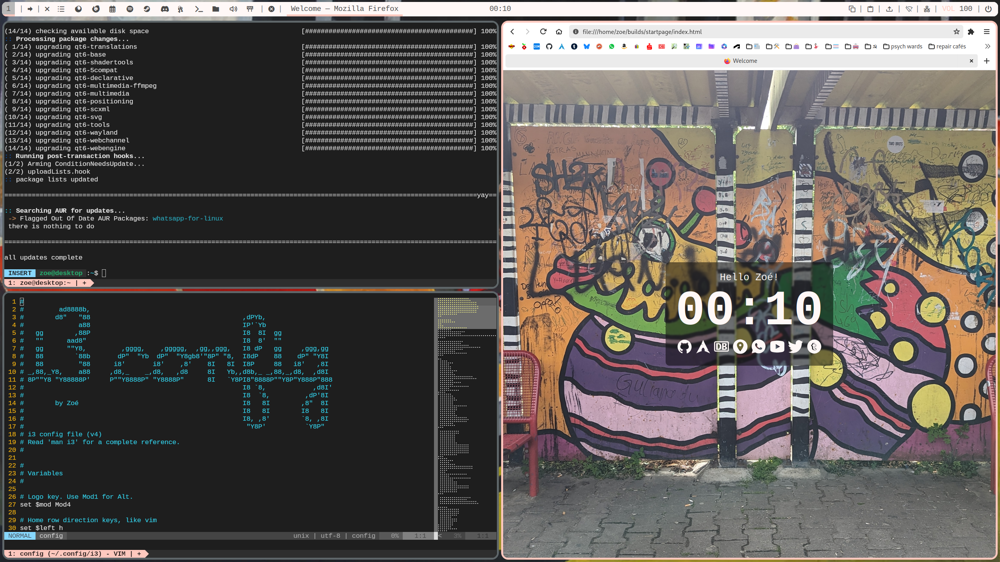

<h1 align="center"> dotfiles </h1>

  

  

## Setup

- OS : [Arch Linux](https://archlinux.org/)
- WM : [i3-gaps](https://github.com/Airblader/i3/)
- Bar : [Polybar](https://github.com/polybar/polybar)
- Terminal : [kitty](https://sw.kovidgoyal.net/kitty/)
- Editor : [vim](https://www.vim.org/)
- Launcher : [rofi](https://github.com/davatorium/rofi)
- Compositor : [picom](https://github.com/yshui/picom)
- Fonts : [Liberation Fonts](https://github.com/liberationfonts/liberation-fonts), [Nerd Fonts](https://github.com/ryanoasis/nerd-fonts)

## Credits

- Cursor : [Apple Cursor](https://github.com/ful1e5/apple_cursor)
